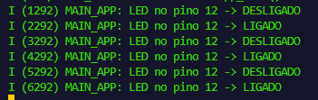

# Blink com FreeRTOS Task (ESP-IDF)

Este módulo apresenta a implementação prática de uma aplicação de piscar de LED (Blink) utilizando os conceitos do sistema operacional de tempo real FreeRTOS nativo do framework ESP-IDF, em execução na plataforma ESP32 DevKit V1. O objetivo principal consiste em substituir a abordagem tradicional de loops bloqueantes sequenciais por uma estrutura profissional baseada no gerenciamento assíncrono de tarefas (tasks).

## Fundamentos e Arquitetura do Software

A arquitetura do software explora o ciclo de inicialização do microcontrolador e o ecossistema multitarefa. Ao inicializar o hardware, a função de entrada padrão `app_main()` é executada de forma nativa dentro de uma tarefa prioritária gerenciada pelo próprio FreeRTOS. No escopo dessa função, a API `xTaskCreate` é invocada explicitamente para alocar memória e instanciar a tarefa `vTaskBlinkLED` de maneira independente na CPU. Após cumprir o papel de configurar o escalonamento do sistema, o fluxo da `app_main` encerra-se voluntariamente e seus recursos de memória (stack) são liberados para o sistema operacional através do mecanismo interno de desalocação.

A tarefa `vTaskBlinkLED` assume o controle contínuo do periférico configurado no pino GPIO 12. O loop interno executa a inversão de estado digital do pino através da função `gpio_set_level` e exibe mensagens de status padronizadas em tempo real. O sincronismo e a temporização do circuito são determinados pela macro `pdMS_TO_TICKS(1000)` inserida na função `vTaskDelay`. Este método impede o desperdício de ciclos de processamento ao colocar a respectiva tarefa em estado de bloqueio controlado por exatamente um segundo, permitindo que o escalonador execute processos secundários de background enquanto o tempo regulamentar do hardware transcorre.

## Estrutura do Sistema de Diagnóstico (Logging)

Para fins de monitoramento profissional em sistemas embarcados, este projeto substitui a chamada genérica de impressões síncronas de texto pela macro de rastreamento oficial `ESP_LOGI`. A biblioteca `esp_log.h` fornece uma estrutura que indexa rótulos de tempo (timestamps em milissegundos) e tags identificadoras ao terminal de depuração. Esta configuração permite analisar o comportamento assíncrono e a alternância de estados lógicos do pino com precisão de hardware através do monitoramento serial.

## Resultados do Monitor Serial
