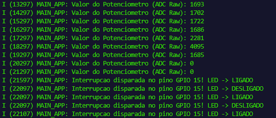

# Interrupções por Hardware (ISR), Filas (Queue) e Conversão Analógica (ADC) com FreeRTOS

Este projeto tem como objetivo demonstrar a integração de periféricos fundamentais e o gerenciamento de tarefas de tempo real utilizando o framework ESP-IDF sobre o sistema operacional FreeRTOS. A aplicação foi desenvolvida focando na eficiência energética e de processamento, substituindo a prática ineficiente de varredura contínua (polling) por um modelo assíncrono baseado em interrupções externas de hardware acopladas a estruturas de sincronização seguras.

A arquitetura do firmware divide-se em dois fluxos principais e independentes executados concorrentemente. O primeiro fluxo gerencia o acionamento de um botão conectado a uma linha de interrupção externa que, ao ser pressionado, delega o processamento pesado a uma tarefa dedicada por meio de uma fila. O segundo fluxo realiza amostragens periódicas de um potenciômetro através do conversor analógico-digital (ADC1), exibindo os níveis de tensão digitalizados de forma contínua no monitor serial.

---

## 🎛️ Configuração de Hardware e Pinagem

As conexões físicas foram estruturadas conforme a seguinte distribuição:

* **Botão de Pressão (Push Button)**: Conectado entre o pino físico D15 (GPIO 15) e a linha de referência de Terra (GND), operando com o resistor de pull-up interno ativo para garantir nível lógico estável em repouso.
* **LED Indicador**: Conectado ao pino físico D2 (GPIO 2) em série com um resistor limitador de corrente de 220 Ohms direcionado ao GND, atuando em paralelo com o LED azul integrado na própria placa de desenvolvimento.
* **Potenciômetro de 10K Ohms**: Os terminais extremos foram soldados respectivamente nas linhas de barramento de 3.3V (3V3) e Terra (GND). O terminal central de sinal foi conectado ao pino D34 (GPIO 34), que está diretamente associado ao canal seguro ADC1_CH6 do conversor analógico-digital.

---

## 🛠️ Detalhes da Implementação de Software

A lógica de software foi estruturada para evitar condições de corrida e travamentos de núcleo. A rotina de serviço de interrupção (ISR) do botão realiza apenas o envio não-bloqueante do evento para a fila do FreeRTOS através da API dedicada para interrupções, permitindo que a CPU retorne imediatamente às suas tarefas de rotina.

A leitura do potenciômetro utiliza a API unificada One-Shot do ESP-IDF v6.x, configurada para operar com resolução nativa de 12 bits, mapeando a tensão física de entrada em uma escala digital que varia linearmente de 0 a 4095. O isolamento de prioridades entre a tarefa de tratamento do botão e a tarefa de amostragem do ADC garante a responsividade imediata do sistema a estímulos externos de hardware.

## Resultados do Monitor Serial
